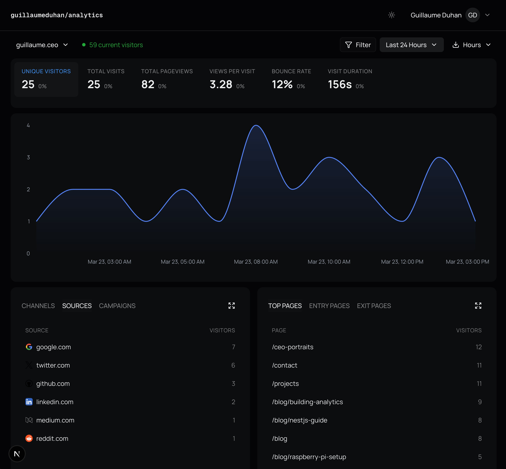

# Analytics-G

Self-hosted, privacy-friendly, **multi-site** web analytics — track pageviews, events, and visitor sessions across all your domains without third-party services.



## Get started

### 1. Clone the project

```bash
git clone https://github.com/guillaumeduhan/analytics.git
cd analytics
```

### 2. Run the installer

```bash
chmod +x install.sh
./install.sh
```

The script checks your machine and installs what's missing (Node.js, yarn, PostgreSQL, PM2). Then it sets up the API and the frontend for you.

### 3. Configure your environment

The installer creates `.env` files from examples. Edit them with your own values:

**API** (`API/.env`):

| Variable | Description |
|---|---|
| `DATABASE_HOST` | PostgreSQL host (e.g. `localhost`) |
| `DATABASE_PORT` | PostgreSQL port (default: `5432`) |
| `DATABASE_USER` | PostgreSQL user |
| `DATABASE_PASSWORD` | PostgreSQL password |
| `DATABASE_NAME` | Database name (e.g. `analytics`) |
| `PORT` | API port (default: `4200`) |
| `API_KEY` | Secret key to protect your API endpoints |

**Frontend** (`frontend/.env.local`):

| Variable | Description |
|---|---|
| `NEXT_PUBLIC_API_URL` | Your API URL (e.g. `http://localhost:4200`) |
| `NEXT_PUBLIC_API_KEY` | Same API key as in `API/.env` |

The API key must match in both files.

### 4. Start the project

**Development:**

```bash
make dev
```

Or manually:

```bash
cd API && npm run start:dev
cd frontend && npm run dev
```

- API: http://localhost:4200
- API docs: http://localhost:4200/docs
- Frontend: http://localhost:3000

**Production:**

```bash
make deploy
```

### 5. Add the tracking script

Once your instance is running, add this snippet to the `<head>` of every site you want to track:

```html
<script defer data-domain="YOUR_DOMAIN" src="YOUR_API_URL/js/tracker.js"></script>
```

Replace `YOUR_API_URL` with your API base URL and `YOUR_DOMAIN` with the site domain registered in your dashboard.

To track custom events:

```js
ag("Signup", { plan: "pro" });
```

## Project structure

```
analytics/
├── API/                  # NestJS backend
├── frontend/             # Next.js dashboard
├── ecosystem.config.js   # PM2 config (API + frontend)
├── install.sh            # Auto-installer
└── makefile              # Shortcuts
```

## Tech stack

| Component | Technology |
|---|---|
| Frontend | Next.js, React, Tailwind CSS, Recharts, shadcn/ui |
| API | NestJS, TypeScript |
| Database | PostgreSQL, TypeORM |
| Hosting | Raspberry Pi 4 *(optional, self-hosted)* |
| Process Manager | PM2 *(optional, self-hosted)* |
| Tunnel | Cloudflare Tunnel *(optional, self-hosted)* |

## Features

- Pageview tracking — automatic page load and navigation
- Custom events — clicks, form submissions, conversions
- Session management — device, browser, OS, geo data
- UTM campaigns — source, medium, campaign attribution
- Realtime — live visitor count
- Multi-site — track all your domains from one dashboard
- Privacy-first — no cookies, no personal data, self-hosted
- API key auth — protected endpoints with X-API-Key header
- Swagger docs — auto-generated at /docs

## License

MIT
